# Flow Cytometry Tutorial

This tutorial walks through how to use flow cytometry data in ESM. It is recommended that you go through the [Getting Started with ESM](@ref) tutorial first, so you are familiar with some of the more general features of ESM.

We will go through the analysis of some flow cytometry data ([downloadable here](https://github.com/eebio/esm/raw/refs/heads/main/docs/src/assets/ESM-flow-tutorial-data.zip)), including gating, transforms and bead calibration.

## Summarise

Like with plate reader data, we can call `esm summarise` on flow cytometry data. You don't need to specify the `--type` since ESM can work it out from the file extension.

```bash
esm summarise beads/20260325_ESM_Rainbow2_Experiment_Group2_E3.fcs -p
```

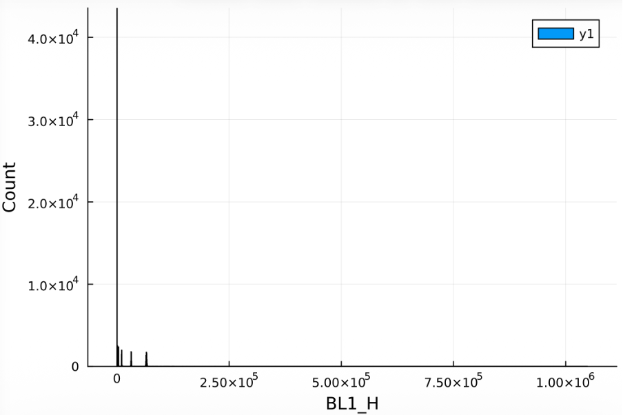

## Importing Flow Cytometry Data Into ESM

We will now create our template file, point to our flow data, add some groups, and generate some views.

```bash
esm template
```

### Samples

Flow cytometry data is typically stored as a folder of files for each well. ESM can read and import a folder of flow cytometry data, automatically extracting well IDs.

!!! note "Flow cytometry folders"
    When importing a folder of flow cytometry data, ESM will attempt to read well names (either in the form A1 or A01, surrounded by some non-alphanumeric characters). It will then attempt to verify the well IDs it finds using the \$WELLID metadata parameter in the FCS files. If the file doesn't have a \$WELLID parameter, the verification is inconclusive. The results of the verification are displayed when the template file is translated. `esm summarise` can't be used with flow cytometry folders.

The inputs needed for ESM are fairly simple here. Just pointing to the data, setting up the plate layout as groups and then creating a view of the beads data.

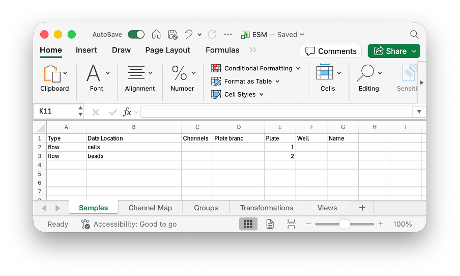

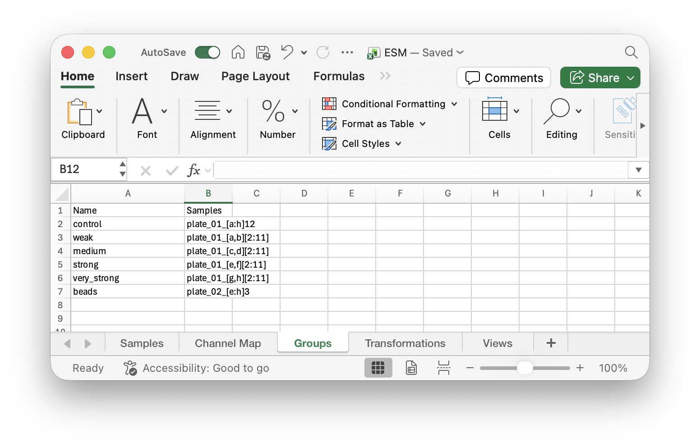


```bash
esm translate ESM.xlsx ESM.esm 
```

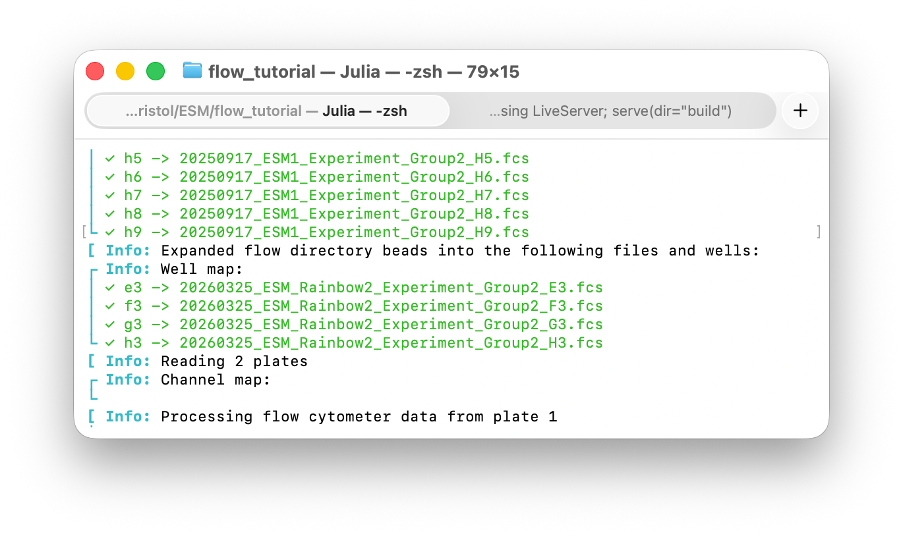

The well IDs are correctly verified, as seen by the green check marks in the well map. Alternatively, they could have been yellow question marks (unable to verify), or red crosses (verification revealed a non-matching \$WELLID).

### Generating Views

We can now generate our view of the beads data to see how it is stored.

```bash
esm views ESM.esm -v v_beads
```

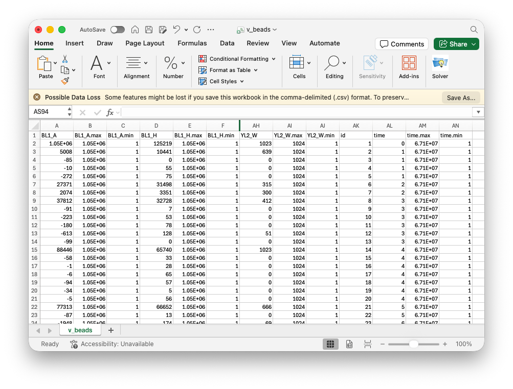

Since we didn't specify which channels to load in the samples sheet, all channels were loaded for the beads. Note that this includes a special `time` channel. Every channel also has a min and max (the limits of the machine, not necessarily the limits of the recorded data). There is also an `id` column which is preserved through gating.

Now that we have a nice simple csv of our data, we have generate plots in whatever software we want. Here, we have used R and ggplot2 to plot a histogram of the `BL1_H` channel.

```R
library(ggplot2)

beads <- read.csv("v_beads.csv")

ggplot(beads, aes(x=BL1_H)) + 
  geom_histogram(bins=500) + 
  labs(title = "Beads")
ggsave(paste0("flow-Beads.png"), width=4, height=2.5)
```

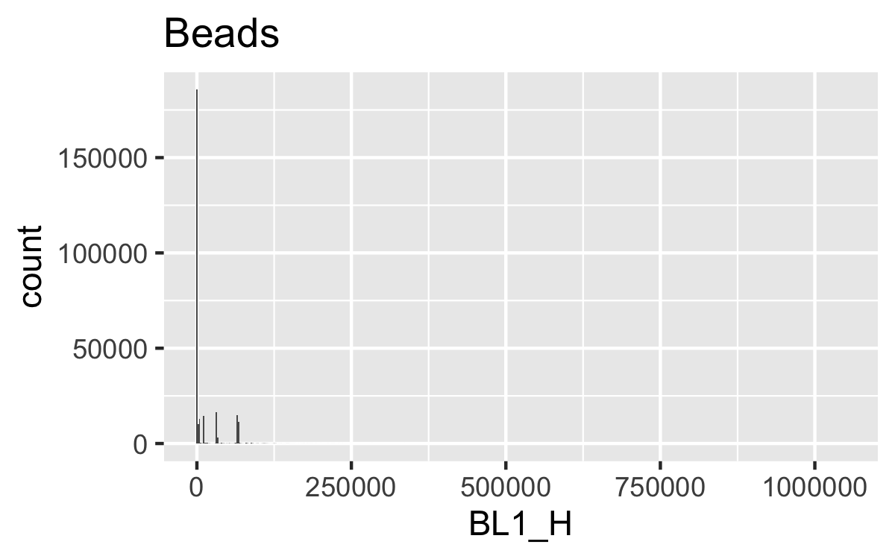

## [Transforms](@id fc_tut_transforms)

Flow cytometry data is rarely read on a linear scale (like we plotted above). While some transformations are easily to implement (like log transforms), flow cytometry commonly uses transforms that are much harder to implement, such as Logicle or Hyperlog. ESM provides implementations of these transformations built in. We will transform the data using a Logicle scale and view the transformed data.


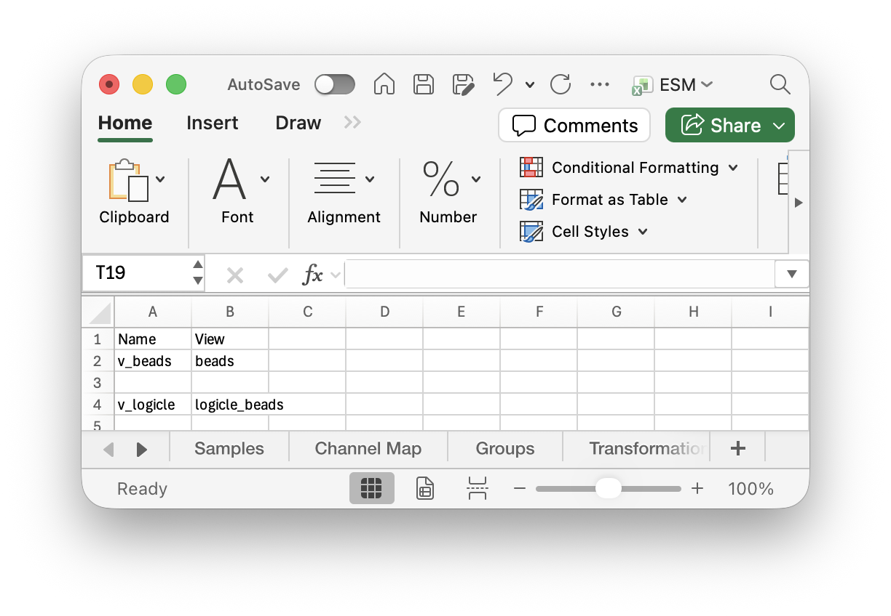

```bash
esm translate ESM.xlsx ESM.esm; esm views ESM.esm -v v_logicle
```

.png)

We can now clearly see the different beads. In this case, we should have 7 different fluorescences for the beads and one corresponding to debris. The debris here is quite large and looks like it may slightly overlap with the lowest fluorescence beads, so we should try to gate the data and remove the debris.

## [Automatic Gating](@id fc_tut_autogating)

Simple biological systems, like E. Coli, typically only need gating to remove debris (as opposed to separating by cell type that is common in more complex systems like mammalian cells). When this is the case, autogating (or density gating) may be sufficient, removing the need to manually gate the data, or making manual gating easier.

We should provide two channels to be used for the gating, here `FSC_A` and `SSC_A`. We also provide a transform for those channels, so that the data is more evenly spread out across the full range. We also include a `gate_frac` (the percentage of data to keep after autogating) which has been manually tuned to remove the most debris.

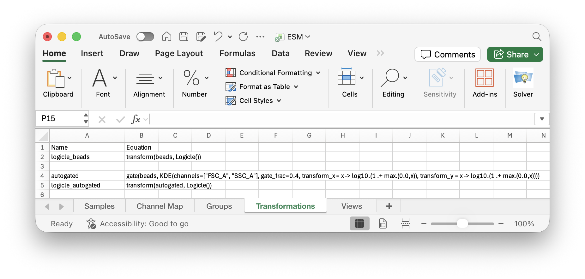

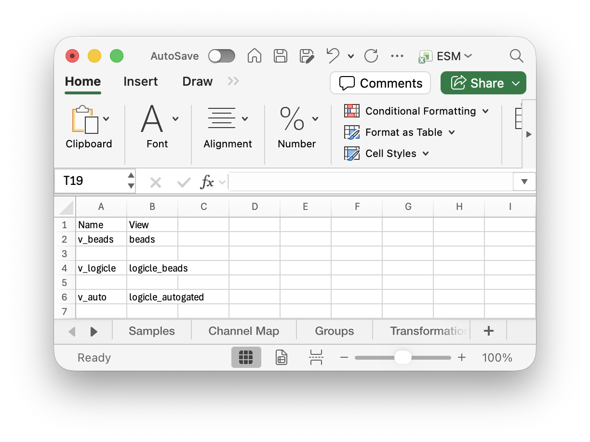

```bash
esm translate ESM.xlsx ESM.esm; esm views ESM.esm -v v_auto
```

.png)

You can also manually gate data. The same `gate` function is used. More information can be found in the [Manual Gating](@ref) documentation.

## [MEF Calibration](@id fc_tut_mef_calibration)

Now, we can calibrate the `BL1_H` fluorescence data for each of our groups based on the autogated beads. We need to provide the channel we are calibrating (`BL1_H` in this case), the corresponding MEF for each type of beads, in order of ascending `BL1_H`. We can provide an MEF value of `nothing` to mean a peak in `BL1_H` that doesn't correspond to an MEF value (to accomodate debris or bad clustering). You can also provide options for the clustering algorithm (such as `nRepeats=1` used here). Finally, `plot_directory` specifies where to save plots of the clustering and standard curve for inspection. Further details of the options available in the [MEF Calibration](@ref) documentation.

!!! note "Seeded calibration"
    The MEF calibration has a set seed for the random number generation and the clustering and standard curve generation only depends on variables defined in the `MEF` method. So we only need to plot for a single calibration call, the other groups are calibrated using exactly the same standard curve.

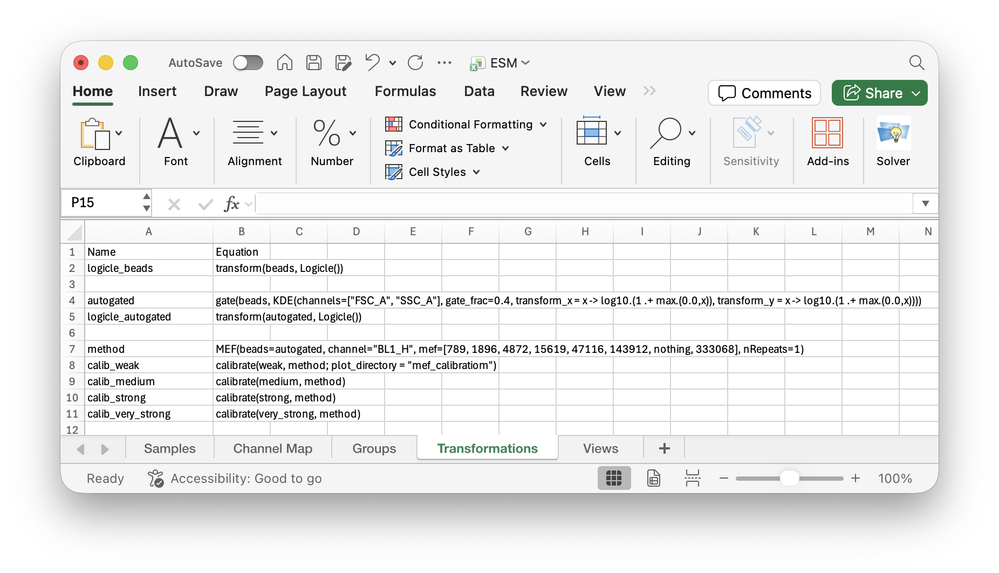


```bash
esm translate ESM.xlsx ESM.esm; esm views ESM.esm -v v_weak,v_medium,v_strong,v_v_strong
```

In the first step, the bead data is extracted and transformed.

!!! todo "Bead transform"
    In future, the transform for the bead data will be customisable.

It is then clustered using a mix of k-means and Gaussian mixture models. Data corresponding to clusters where `MEF=nothing` are removed. In this case, we had previously set the 7th cluster to be removed.

!!! tip "How do you know which cluster you will want to remove?"
    In most instances, the gating should be good enough that you don't need to remove any clusters. If you do still have some debris (or in our case possibly doublets), you can try running the clustering with an extra cluster (placed arbitrarily) and then figure out which cluster to remove after running it once. This is the process we used here. Clustering with 7 clusters looked poor, an additional value of `nothing` was added to the start of the `MEF` vector and the calibration was run. This plot revealed that the clustering improved when 8 clusters were used and cluster 7 ends up corresponding to unwanted data, so calibration is rerun where `MEF[7] = nothing`.

!!! tip "How do I know if my clustering is acceptable?"
    A key thing to remember is that the clustering is only required for figuring out the locations of each of the peaks. If the verticle dashed lines match up with the peaks in your data, then the clustering is good enough for generating the standard curve and calibrating. If you are really struggling to get a particular peak, consider setting the corresponding MEF values to `nothing`, this way the datapoint will just be ignored for standard curve generation.

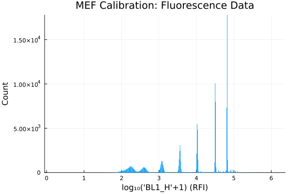
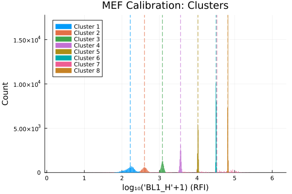

The red standard curve line will always be straight, but the green beads model line may curve downwards, corresponding to the autofluorescence of the beads. In this case, the autofluorescence wasn't determined, but the standard curve is still fine for calibration.

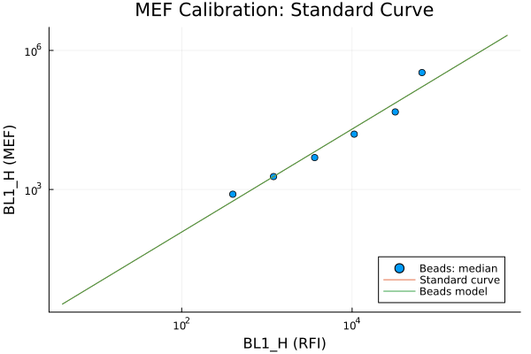

We can now plot our MEF calibrated fluorescence data. If we wanted to continue this analysis, we could look at autogating the cell data and then we could compare the different promoter strengths statistically.

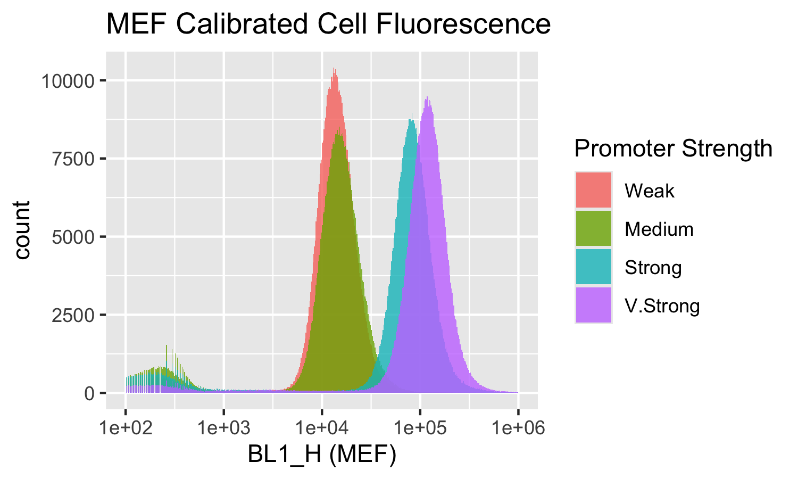

## Next Steps

If you want to further explore the flow cytometry functionality in ESM, you could check out:

* [Automatic Gating](@ref) to find out how the autogating algorithm works and other options you can use,
* [Manual Gating](@ref) wasn't detailed in this tutorial, although is very similar in use to the autogating,
* [MEF Calibration](@ref) to dive deeper into how the method works and how you can use it,
* [Transforms](@ref) to learn about the other transformations you can apply to flow cytometry data.
