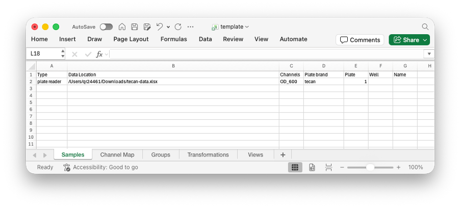
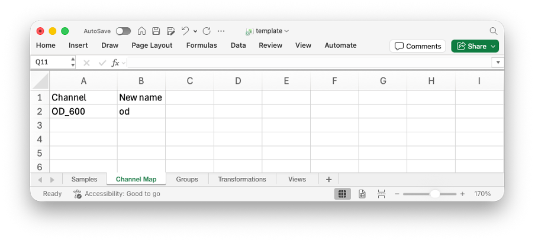
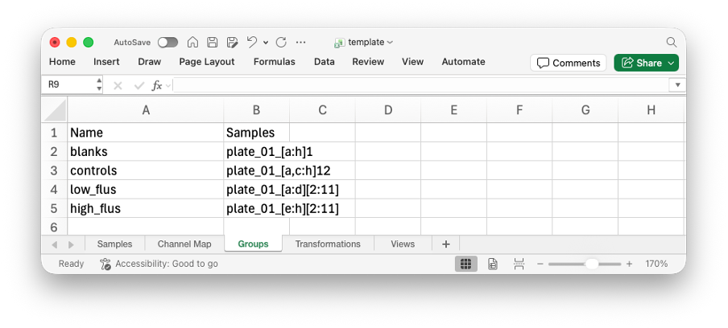
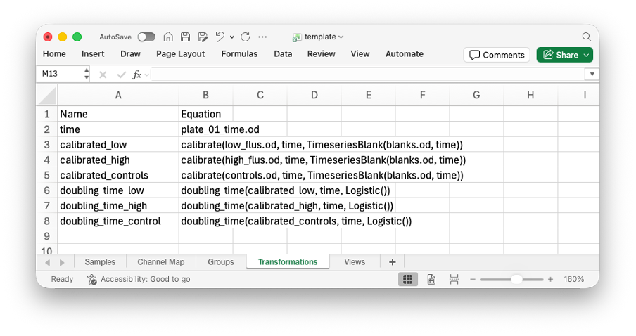
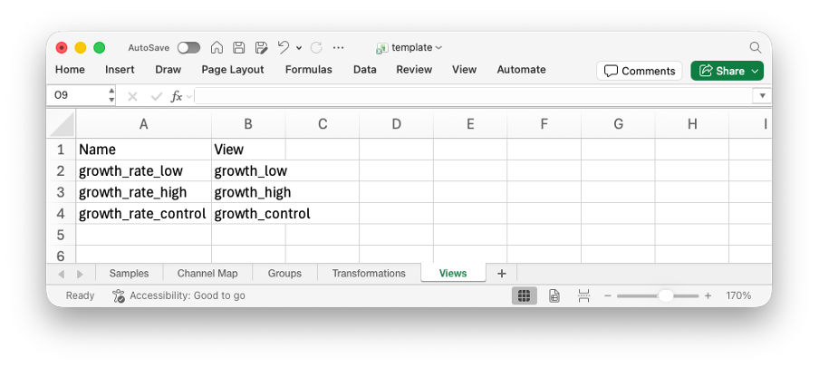

# Getting Started with ESM

This tutorial will walk you through the complete workflow of processing experimental data with ESM, from initial data exploration to final visualization. We'll use a sample flow cytometry dataset to demonstrate each step.

## Prerequisites

!!! todo
    How to install ESM (in particular the CLI)

## Step 1: Explore Your Data

First, let's examine what data we have using the command line interface. We can use `esm summarise` on any ESM-compatible data file (`.fcs`, `.esm`, plate reader `.txt`, `.tsv`, `.csv`, etc.).

```bash
# Navigate to your data directory
cd /path/to/your/data

# Get an overview of your data files (-p enables plotting)
esm summarise data.fcs -p
```

This will show you some summary information about your data (number of samples, time ranges, etc.) and (since we enabled plotting with `-p`) it will produce a PDF file under the name `data.fcs.pdf` with plots of the data to explore.

## Step 2: Create a Template File

Now let's create a template file that will define how to process your data:

```bash
# Create a template for flow cytometry data
esm template --output template.xlsx
```

This creates an Excel file called `template.xlsx` where we can provide ESM with extra information about your data.

## Step 3: Fill in the Template

We will provide an example of how we can fill in the Excel template file here. For a more in depth look, check out the [Excel Interface](@ref).

### Step 3.1: The Samples Sheet

The first three columns control the final naming for the samples.

The type defines whether the data is "plate reader", "flow", or "qpcr" and how that file should be imported.

The data location gives the full filepath to the data.

Channels identifies the specific channels that you would like to save in the ESM file. If left blank, then all will be saved.

Finally, we have the plate reader brand. This identifies the format the data will be in. Available options are: "spectramax", "biotek", and "tecan". Leave it blank for other data types.



### Step 3.2: The ID Sheet

Here you can rename any channels. On the left, provide the channel name, as specified on the previous sheet. On the right, provide the new name for the channel. In this example, rather than using "plate_01_a5.600", we would then use "plate_01_a5.od".



### Step 3.3: The Groups Sheet

In this sheet, you can group samples together. For example, you may want to group all of your blank well together to make them easier to refer to.

There are a few formats for doing this. The simplest is to just write out all the samples in a comma separated list (i.e. "plate_01_a1, plate_01_a2, plate_01_a3").

To make this a bit shorter, you may choose to use the compressed format. In this format, anything specified in `[]` is expanded.

More details about the compressed format can be seen at [Excel Interface](@ref)

Here, we use the compressed format so that:

* all wells on the left of a 96 well plate (A through H, column 1) are grouped as "blank",
* all wells on the right (A through H, column 12) are groups as "control",
* the remaining wells (A through H, columns 2 through 11) are split into pairs of rows (A and B, C and D, E and F, G and H) into the groups "ee01", "ee02", "ee03", "ee04".



### Step 3.4: The Transformations Sheet

On the transformations sheet, you can define the post-processing you want to apply to your data. This typically involves calibrations and calculating summary statistics.

In the example below, we calibrate our groups based on the blank group, then calculate growth rates on each of the calibrated transformations. Finally, the data is collected together (the "processed" variable appends the different DataFrames together) and this is normalised by the mean of the controls.

More details about some of the inbuilt methods in ESM, like `growth_rate` can be found in the [Plate Reader](@ref plate_reader), [Flow Cytometry](@ref flow_cytometry), and [qPCR](@ref qpcr) documentation.



### Step 3.5: The Views Sheet

Finally, the views describe a subset of transformations, groups and samples that you actually want to look at, outside of ESM. This is typically used for your final post-processed data, but can also be useful for debugging (viewing inputs and outputs from a transformation to make sure it is working as intended).

In the example below, we have a single view named "growth_rate", which uses the "normalized" transformation we defined previously.



!!! tip
    We've gone through how to fill in the Excel template quite quickly. If you want more in depth information, try checking out the [Excel Interface](@ref) page which uses the same example, but goes into more details on what is allowed.

## Step 4: Process the Data

Convert your template and data into an `.esm` file:

```bash
# Translate the template and data into ESM format
esm translate --excel template.xlsx --target data.esm
```

This will:

* Read all specified data files
* Combine results into a single ESM file

## Step 5: Explore the Results

We can now look at our calculated growth rates from our data.

```bash
# Get an overview of processed data
esm views experiment.esm
```

## Best Practices

1. **Summarise Data Early**: Looking at plots of the data can help identify issues like contaminated wells, that may change how you want to analyse the data.
2. **Start Small**: Its easy to .
3. **Close Excel**: `.xlsx` files behave differently if they are open vs. closed and `esm translate` will only work properly if you don't have the template open at the same time.
4. **Remember the order of ESM operations**: Using `esm translate` will import and check your raw data, and collect groups, but it won't check your transformations and views. If you are getting errors when trying to generate views, this may be due to transformations being incorrectly defined, rather than just your views.

## Next Steps

Now that you've processed your data with ESM, you can:

* Perform statistical analysis using the post-processed data
* Create publication-quality plots
* Share ESM files with collaborators or as supplementary material
* Integrate with computational pipelines

If you want to learn more about ESM, you can go to:

* [Plate Readers](@ref plate_reader) to learn about the functionality and different methods available for working with plate reader data.
* [Flow Cytometry](@ref flow_cytometry) to learn about the calibration and gating methods available for working with flow cytometry data.
* [qPCR](@ref qpcr) to learn about the methods available for working with qPCR data.
* [Command Line Interface](@ref) to learn about all the features of the command line interface (`esm summarise`, `esm translate`, etc.).
* [Data Format](@ref) to learn about how `.esm` files are structured.
* [Excel Interface](@ref) to learn more details about how the Excel template file works and its format.

## Getting Help

If you encounter issues, [open a new issue](https://github.com/eebio/esm/issues/new) with details about your problem.
