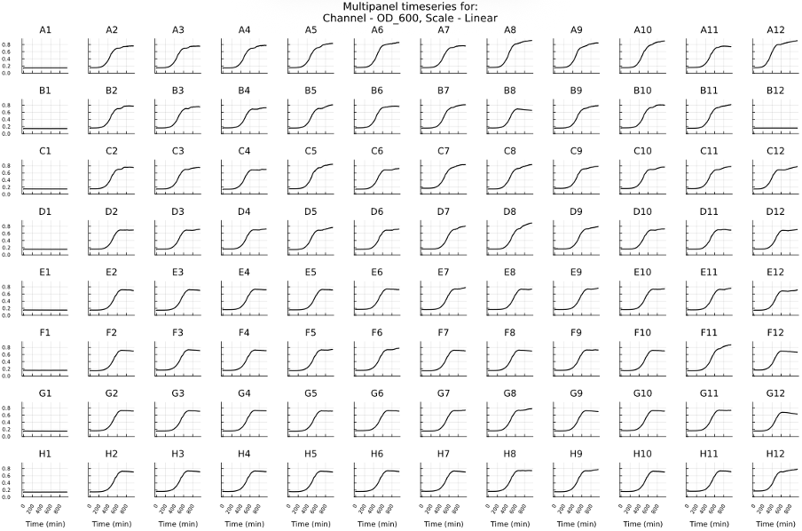
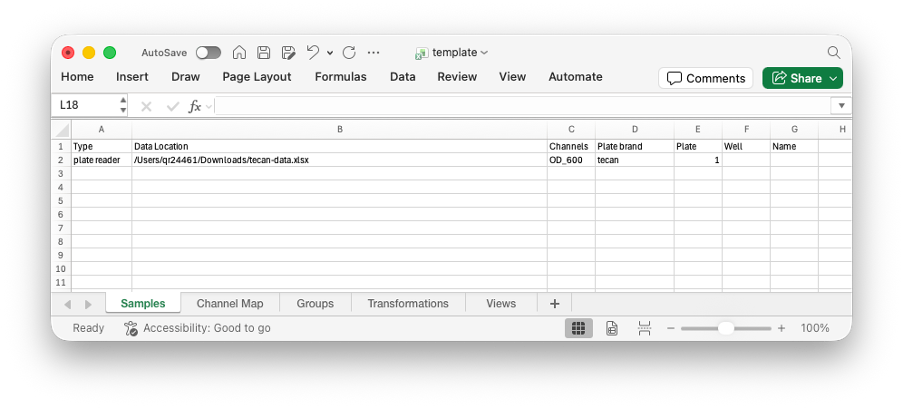
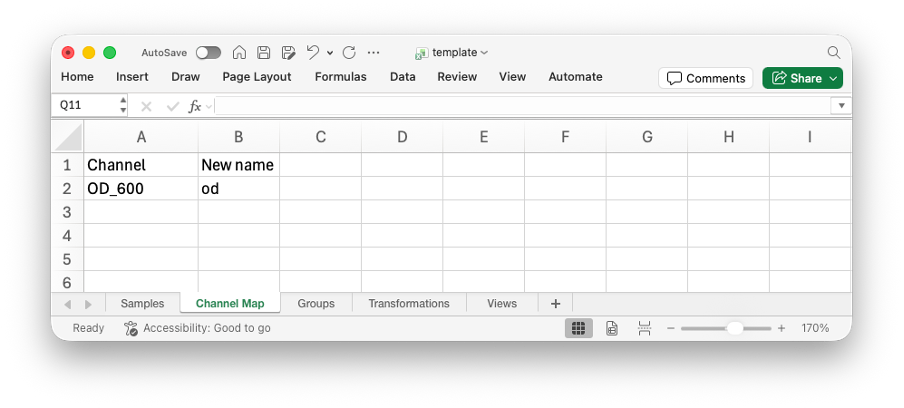
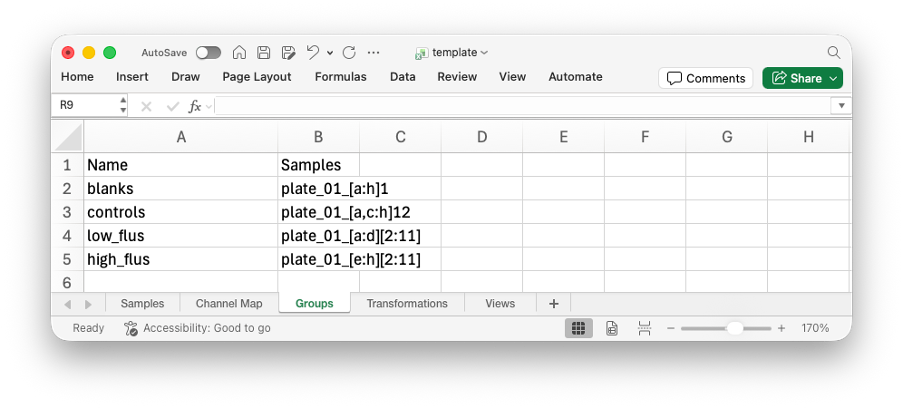
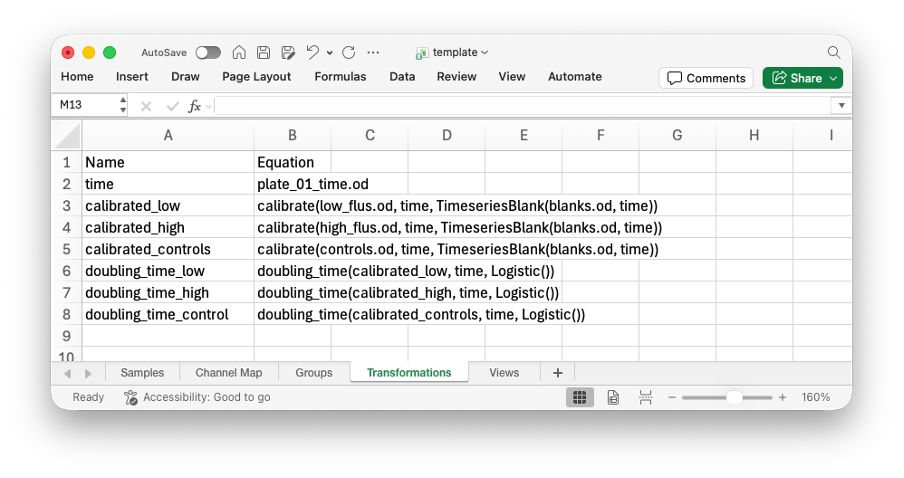
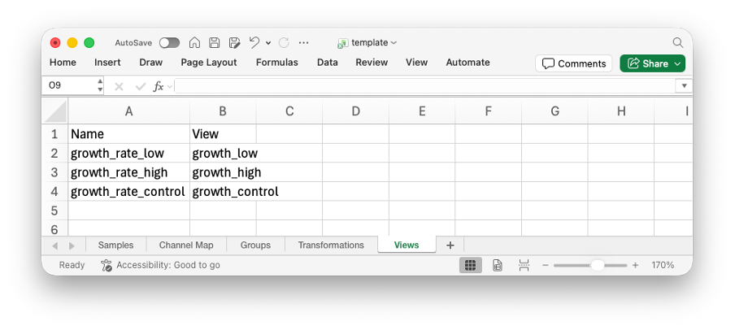

# Getting Started with ESM

This tutorial will walk you through the complete workflow of processing experimental data with ESM, from initial data exploration to final visualization. We'll use some sample plate reader data (that you can download to follow along).

## Prerequisites

!!! note "For Windows users"
    For Windows users, this tutorial assumes you are using PowerShell, although this is not required to use ESM.

### Installing ESM

1. [Download the source code](https://github.com/eebio/esm/archive/refs/heads/main.zip) and unzip it.
2. [Download Julia](https://julialang.org/) if you don’t already have it installed.
3. Run `julia —project -e ‘using Pkg; Pkg.build()’` from the root directory of the repository (i.e. /where/you/saved/source/code/esm).
4. You can test if its working by running `esm template -h`, if you see some documentation appear, ESM is successfully installed.
5. If you instead see an error `command not found: esm`, you may need to add `~/.julia/bin` to your PATH.

!!! tip "Adding ~/.julia/bin to your path"
    In order for your terminal to find esm, you may need to edit the PATH variable. How exactly you add a directory to your PATH depends on what shell you are using and your operating system. You can find this out by running the command `echo $0`. Common shells include Bash, zsh, and PowerShell. If using Bash, add the line `PATH=$PATH:~/.julia/bin` to `~/.profile` or `~/.bash_profile`. If you are using zsh, add the line `PATH=$PATH:~/.julia/bin` to `~/.zprofile` (or add `~/.julia/bin` to `/etc/paths` on MacOS).

!!! todo "Windows powershell path"

### Downloading the data

You can download the plate reader data from [this link](https://github.com/eebio/esm/raw/refs/heads/main/test/inputs/tecan-data.xlsx).

## Step 1: Explore your data with esm summarise

First, let's examine our dataset using the command line interface. We can use `esm summarise` on any ESM-compatible data file (`.fcs`, `.esm`, raw plate reader, etc.).

To view the help guide for `esm summarise`, you can use `esm summarise -h`.

```@docs; canonical=false
ESM.summarise
```

Our plate reader data is from a Tecan machine, and we want to generate plots of the data to see if it looks like we expect, so we specify the `--type` option as `tecan` and add the `--plot` flag.

```bash
esm summarise tecan-data.xlsx --type tecan --plot
```

!!! tip "Short options"
    You can also use short options for all the esm commands. In place of `‑‑type`, you can use `‑t`, similarly with `‑‑plot` and `‑p`. The following are all valid ways of specifying the type option: `‑ttecan`, `‑t=tecan`, `‑t tecan`, `‑‑type tecan`, `‑‑type=tecan` (but not `‑‑typetecan`).

Running `esm summarise` gives us some summary information about the channels available in the data, time ranges, number of wells/samples, etc. which is all printed to the terminal.

Since we used `--plot` (or `-p`), we now have a `tecan-data.xlsx.pdf` file with a few different plots of our data. Lets have a look at the `OD_600` channel, on a linear scale.



After looking over our data, it's clear that the cells in the B12 well have failed to grow (A1-A12 are blanks, A12-H12 are negative controls). We will need to remember to exclude that from our analysis later. All the other wells look healthy, so we can move ahead with our analysis.

## Step 2: Begin the analysis with esm template

Now that we know our data is good, we can begin analysing it. To do this, we need to create an esm template file using, you guessed it, `esm template`.

You can look at the help guide for `esm template` by running `esm template -h`. You'll see we can optionally specify a filepath for the template file (which will be a .xlsx file).

```@docs; canonical=false
ESM.template
```

```bash
esm template --output-path template.xlsx
```

This creates an Excel file called `template.xlsx` where we can provide ESM with information about your data, like file locations and machine types.

!!! tip "Required vs optional"
    You might see in `esm template -h` that `--output-path` has a default behaviour. If you don't specify an output filepath, it will add the template file as `ESM.xlsx` in the current directory. So we could have used `esm template` (with no other options) to get the template file.

## Step 3: Fill in the template

While we provide a short example of how to fill in the Excel template here, it may be useful to check out the more detailed description in the [Excel Interface](@ref) page, after you've finished this tutorial.

The template is split up into five sheets of information to fill out.

### Step 3.1: The Samples sheet

The first sheet to fill out is the **Samples** sheet. This is where you describe the location and type of your data files.

!!! note "Data formats"
    ESM allows you to import raw machine outputs for plate readers and flow cytometers, so you don't need to edit the raw data to put it into a compatible format. If you don't have the original files for your plate reader data, we provide another form for [Generic tabular data](@ref).

We only have a single data file we want to analyse, so we will only fill out one row. If we had more data, we could include it here with additional rows.

The **Type** column defines whether the data is `plate reader` or `flow` and how that file should be imported. This will be `plate reader` for us.

The **Data Location** column gives the full filepath to the data. What you put here depends on where you saved the file **tecan-data.xlsx**.

The **Channels** column identifies the specific channels that you would like to save in the ESM file. If left blank, then all will be saved. Since we are only looking at growth rate here, we will only record the 600nm OD channel (called `OD_600`, as shown with `esm summarise`).

The **Plate Reader Brand** identifies the format the data will be in. Available options are: `spectramax`, `biotek`, `tecan`, and `generic tabular`. Leave it blank for flow cytometry data. This is `tecan` for us.

The last few columns control the names of the data variables. Since plate reader data already provides well names we can leave it blank. The plate name will default to **plate_0\$PLATE\$**, where **\$PLATE\$** is the value in the **Plate** column (we will put `1` here). Alternatively, you can provide a plate name in the **Name** column.

!!! note "Samples, channels, groups and naming conventions"
    In ESM, we refer to the data from a specific well as a sample, accessed under the variable syntax `plate_01_a5`. This includes all channels recorded for well A5 in plate 1. If we want data from a specific channel, as we normally do, we can index it like this: `plate_01_a5.od`. We can also do the same with groups: `blanks.od`, returns only the `od` channel data for the `blanks` group of wells.



### Step 3.2: The Channel Map sheet

Here, you can rename any channels. On the left, provide the channel name, as specified on the previous sheet. On the right, provide the new name for that channel. In this example, rather than using `plate_01_a5.OD_600`, we would then use `plate_01_a5.od`.



### Step 3.3: The Groups sheet

In this sheet, you can group samples together. For example, you may want to group all of your blank well together to make them easier to refer to.

There are a few formats for doing this. The simplest is to just write out all the samples in a comma separated list (i.e. `plate_01_a1, plate_01_a2, plate_01_a3`).

To make this a bit shorter, you may choose to use the compressed format. In this format, anything specified in `[]` is expanded.

Inside a `[]`, you can put a comma seprated list of values, or a range with endpoints separated by `:`.

More details about the compressed format can be seen at [Excel Interface](@ref).

Here, we use the compressed format so that:

* all wells on the left of a 96 well plate (A through H, column 1) are grouped as "blank",
* all wells on the right (A through H, column 12) are groups as "control",
* the remaining wells (A through H, columns 2 through 11) are split into two groups (rows A, B, C and D as `low_flu`, and E, F, G and H as `high_flu`).

We also need to make sure we don't include well B12 in the control group, based on our preliminany look at the data with `esm summarise`.



### Step 3.4: The Transformations sheet

On the transformations sheet, you can define the post-processing you want to apply to your data. This typically involves calibrations and calculating summary statistics.

In the example below, we calibrate our groups based on the blank group, then calculate growth rates on each of the calibrated transformations.

More details about some of the inbuilt methods in ESM, like `growth_rate()` can be found in the [Plate Reader](@ref plate_reader) and [Flow Cytometry](@ref flow_cytometry) documentation, for now though, we will just use `TimeseriesBlank()` for calibration and `Logistic()` for growth rate calculations.



### Step 3.5: The Views sheet

Finally, the views describe a subset of transformations, groups, and samples that you actually want to look at, outside of ESM. This is typically used for your final post-processed data, but can also be useful for debugging (viewing inputs and outputs from a transformation to make sure it is working as intended).

In our example, we have a few views named `growth_rate_low`, `growth_rate_high`, and `growth_rate_control`, each of which refers to the growth rate transformations, although views can also refer to samples or groups, not just transformations.



!!! tip
    We've gone through how to fill in the Excel template quite quickly. If you want more in depth information, try checking out the [Excel Interface](@ref) page, which goes into more details on what is allowed and supported.

## Step 4: Process the data with esm translate

Now we have filled out our template, we can translate it and our data into an esm file with `esm translate`. To see how to do this, lets check out `esm translate -h`.

```@docs; canonical=false
ESM.translate
```

We need to provide two arguments to `esm translate`, the completed template file to input and a file path to save the esm file output.

```bash
esm translate template.xlsx data.esm
```

This will:

* Read all specified data files,
* Combine results into a single ESM file.

!!! note "Transformations are NOT run"
    When the esm file is created, none of the transformations are run. This may mean that you have successfully created the esm file, but there are still mistakes or bugs in the transformations and views.

## Step 5: Explore the results with esm views

The final step is to calculate and output our growth rates, which we can do with `esm views`. Again, you may want to have a look at `esm views -h` to see what is required and what options you can provide.

```@docs; canonical=false
ESM.views
```

We can now look at our calculated growth rates from our data. Lets just have a look at our `growth_rate_control` view for now.

```bash
esm views data.esm --view growth_rate_control
```

!!! tip "Outputting all views"
    If you don't specify the `--view` option, all views will be outputted. Since we have multiple views here, it would be easier to run `esm views data.esm`, but we don't do that so you can see how you specify a particular view you want.

## Best practices

1. **Summarise Data Early**: Looking at plots of the data can help identify issues like contaminated wells, that may change how you want to analyse the data.
2. **Start Small**: Its easy to fill out the template at the start, but this can make it harder to debug the transformations. Try going through, writing a transformation at a time and export it as a view to keep an eye on whats happening.
3. **Save Excel**: Make sure you save the Excel template before calling `esm translate`. Autosaves are not always enough.
4. **Remember the order of ESM operations**: Using `esm translate` will import and check your raw data, and collect groups, but it won't check your transformations and views. If you are getting errors when trying to generate views, this may be due to transformations being incorrectly defined, rather than just your views.

## Next steps

Now that you've processed your data with ESM, you can:

* Perform statistical analysis using the post-processed data,
* Create publication-quality plots,
* Share ESM files with collaborators or as supplementary material,
* Integrate with computational pipelines.

If you want to learn more about ESM, you can go to:

* [Plate Readers](@ref plate_reader) to learn about the functionality and different methods available for working with plate reader data.
* [Flow Cytometry](@ref flow_cytometry) to learn about the calibration and gating methods available for working with flow cytometry data.
* [Command Line Interface](@ref) to learn about all the features of the command line interface (`esm summarise`, `esm translate`, etc.).
* [Data Format](@ref) to learn about how `.esm` files are structured.
* [Excel Interface](@ref) to learn more details about how the Excel template file works and its format.

## Getting help

If you encounter issues, [open a new issue](https://github.com/eebio/esm/issues/new) with details about your problem.
